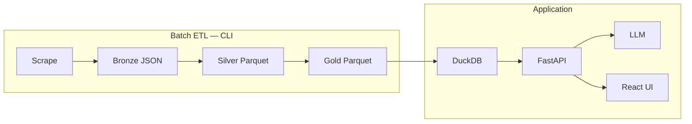

# Film Developer Agent

[](https://github.com/DanielFrc/film-developer-agent/actions/workflows/ci.yml)
[](https://www.python.org/downloads/)
[](LICENSE)

Local-first **medallion ETL pipeline** and **LLM-assisted darkroom assistant**: scrape DigitalTruth → Parquet gold layer → DuckDB queries → FastAPI + React UI → step-by-step development recipes anchored to real chart times.

> **Portfolio / learning project** — demonstrates batch ingestion, star-schema modeling, serverless-ready API boundaries, and RAG-style LLM prompts. Not affiliated with Digitaltruth Photo Ltd. See [docs/LEGAL.md](docs/LEGAL.md).

**Quick start:** [docs/QUICKSTART.md](docs/QUICKSTART.md) · **Interview demo:** [docs/PORTFOLIO.md](docs/PORTFOLIO.md) · **Gold contract:** [docs/DATA_CONTRACT.md](docs/DATA_CONTRACT.md)

---

## Who is this for?

### Data engineers & learners

- Medallion ETL with manifests, parquet, and star-schema modeling
- DuckDB query layer and FastAPI consumer pattern
- LLM integration with cache invalidation on dataset version
- Split-ready design: [docs/DATA_CONTRACT.md](docs/DATA_CONTRACT.md) defines the gold interface between pipeline and app

**Start here:** `film-agent pipeline` → [docs/ARCHITECTURE.md](docs/ARCHITECTURE.md) → [docs/PORTFOLIO.md](docs/PORTFOLIO.md)

### Darkroom users (self-hosted)

- Look up developing times and generate printable recipes
- Save combinations, defaults, and preferences in the browser (export/import JSON in Preferences)
- Dashboard shows dataset freshness after you run the CLI pipeline locally

**Start here:** [docs/QUICKSTART.md](docs/QUICKSTART.md) Path 2 or 3 — gold data required once via CLI

---

## Highlights

| Area | What it shows |
|------|----------------|
| **Medallion lakehouse** | Bronze JSON → silver parquet → gold star schema with manifests |
| **Query layer** | DuckDB in-process over parquet; rapidfuzz search |
| **API** | FastAPI, OpenAPI, structured errors (404/409/502/503) |
| **LLM** | Jinja2 prompts, Ollama/OpenAI, SQLite cache + `source_hash` invalidation |
| **Web UI** | React + Vite — search, recipes, explorer, library, preferences |
| **Ops** | Docker Compose, GitHub Actions CI, `make check` |



---

## Features

- **Pipeline** — `film-agent pipeline` with optional `--skip-scrape`; run manifests under `data/manifests/`
- **Lookup** — film + developer + format + ISO + dilution from normalized gold data
- **Recipes** — LLM generates a 12-section markdown recipe; base developing time never invented by the model
- **Cache** — repeat identical lookups skip the LLM (`cached: true`)
- **Explorer** — browse bronze/silver/gold; film/developer catalog views
- **Personal library** — saved combinations, recipes, defaults, favorites, global + per-film preferences (browser `localStorage`)

---

## Tech stack

| Layer | Tools |
|-------|--------|
| ETL | Python, BeautifulSoup, pandas, pyarrow |
| Storage | Local parquet (S3-ready abstraction in `film_core`) |
| Query | DuckDB, rapidfuzz |
| API | FastAPI, Uvicorn |
| LLM | Ollama (local), OpenAI (optional), Jinja2 |
| Web | React 19, Vite, Tailwind CSS 4, TypeScript |
| Quality | pytest, Ruff, GitHub Actions |

---

## Quick start

```bash
git clone git@github.com:DanielFrc/film-developer-agent.git
cd film-developer-agent

python -m venv .venv && source .venv/bin/activate
pip install -e ".[dev]"
cp .env.example .env

film-agent pipeline          # first time — builds gold data (network)
./scripts/dev.sh             # API :8000 + UI :5173
```

Full paths (CLI-only, Docker, LLM setup, troubleshooting): **[docs/QUICKSTART.md](docs/QUICKSTART.md)**

```bash
make check    # ruff + pytest + web build (same as CI)
```

---

## CLI examples

```bash
film-agent films search "hp5"
film-agent times lookup \
  --film "Ilford HP5 Plus" --developer "Rodinal" \
  --format 120 --iso 400 --dilution "1+50"

film-agent recipe \
  --film "Ilford HP5 Plus" --developer "Rodinal" \
  --format 120 --iso 400 --dilution "1+50" \
  --output recipe.md
```

---

## Project structure

```
film-developer-agent/
├── digitaltruth_scrapper/     # Bronze scrape
├── digitaltruth_processor/    # Silver parquet
├── digitaltruth_normalizer/   # Gold star schema
├── film_core/                 # Pipeline, manifests, DuckDB query layer
├── film_agent_cli/            # Typer CLI (`film-agent`)
├── film_agent_api/            # FastAPI (`film-api`)
├── film_llm/                  # Prompts, providers, recipe cache
├── apps/web/                  # React UI
├── tests/                     # Pytest + fixtures (no live scrape in CI)
├── docs/                      # Architecture, roadmap, quickstart, legal
├── scripts/dev.sh             # Start API + web dev servers
├── compose.yml                # Docker: etl, api, web
└── pyproject.toml
```

Gold output (`data/normalized/`) is **gitignored** — run the pipeline locally. Tests use `tests/fixtures/`.

---

## Documentation

| Document | Purpose |
|----------|---------|
| [QUICKSTART.md](docs/QUICKSTART.md) | Setup: CLI, local UI, Docker |
| [DATA_CONTRACT.md](docs/DATA_CONTRACT.md) | Gold schema & manifest contract (split-ready) |
| [PHASE5_3.md](docs/PHASE5_3.md) | Next: Library split & personal knowledge (planned) |
| [PORTFOLIO.md](docs/PORTFOLIO.md) | Demo script & interview talking points |
| [ARCHITECTURE.md](docs/ARCHITECTURE.md) | Pipeline & data model deep dive |
| [ROADMAP.md](docs/ROADMAP.md) | Phased delivery (Phases 0–5.2 complete) |
| [LEGAL.md](docs/LEGAL.md) | DigitalTruth attribution & OSS boundaries |
| [CONTRIBUTING.md](CONTRIBUTING.md) | How to contribute |
| [CHANGELOG.md](CHANGELOG.md) | Release history |

---

## Development

```bash
pip install -e ".[dev]"
make check
python scripts/export_openapi.py   # after API changes
```

Environment variables: see [.env.example](.env.example) and [QUICKSTART.md](docs/QUICKSTART.md#llm-provider-recipes-only).

---

## Docker

```bash
docker compose up --build api web    # requires ./data gold from local pipeline
docker compose run --rm etl          # one-off full pipeline in container
```

---

## Data source & legal

Development times come from the public [DigitalTruth Massive Dev Chart](https://www.digitaltruth.com/devchart.php). Users run the scraper themselves; **do not commit or redistribute** full scraped datasets. See [docs/LEGAL.md](docs/LEGAL.md) and [NOTICE](NOTICE).

---

## License

MIT — see [LICENSE](LICENSE). Copyright (c) 2025 Marcos Franco.
