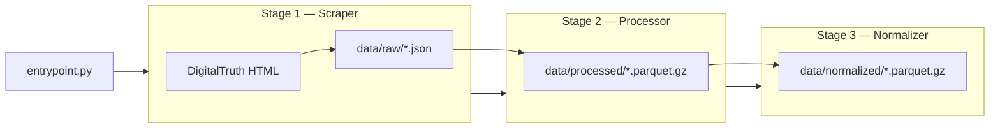
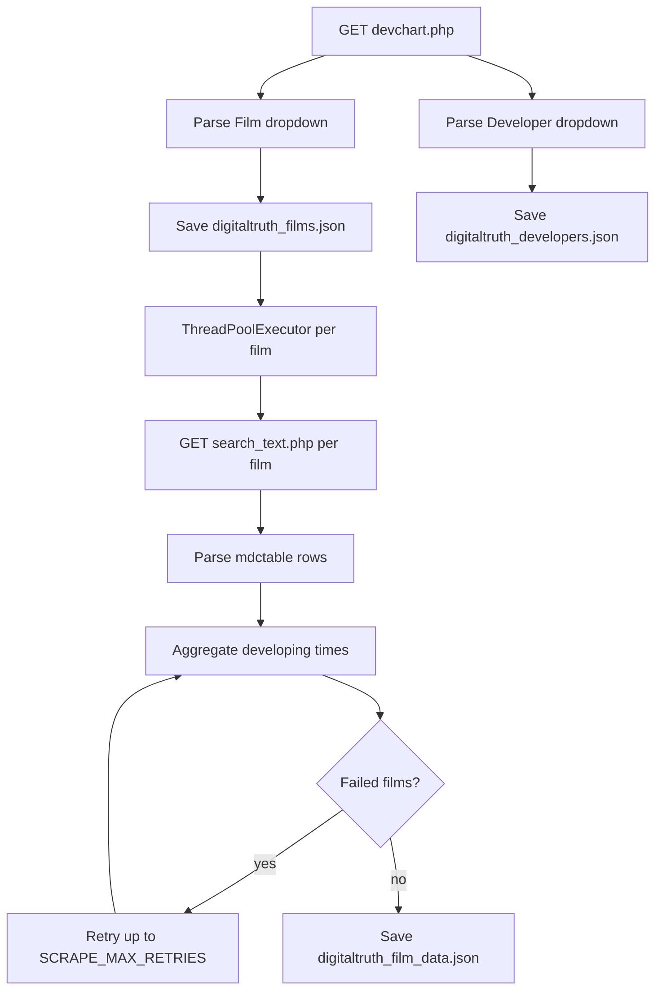
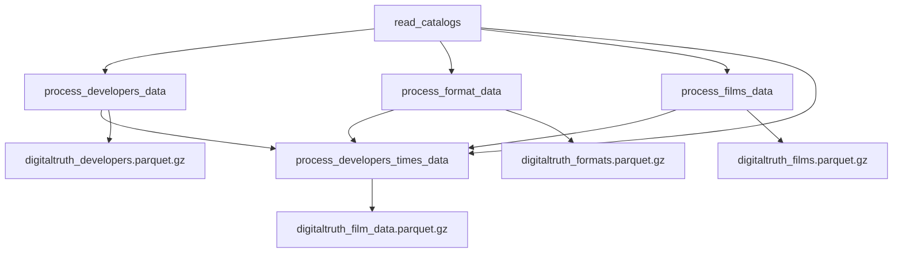
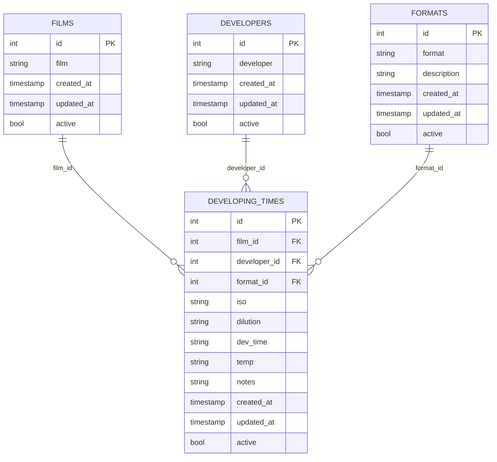

# Architecture — Film Developer Agent (Data Engineering Stage)

This document describes the current ETL pipeline: how data is scraped from DigitalTruth, stored as raw JSON, and transformed into normalized Parquet tables.

## High-Level Overview



The pipeline is **three-stage and file-based**:

1. **Scraper** (`digitaltruth_scrapper/`) — bronze JSON + metadata.
2. **Processor** (`digitaltruth_processor/`) — silver typed Parquet (wide fact table).
3. **Normalizer** (`digitaltruth_normalizer/`) — gold star-schema Parquet for API/CLI.

`digitaltruth_transformer/` remains as a backward-compatible alias that runs processor + normalizer.

Stages can run independently. Tests use fixtures under `tests/fixtures/`; pipeline output under `data/` is local and gitignored.

---

## Entry Points

| Command | What it runs |
|---------|--------------|
| `python entrypoint.py` | Full pipeline: scrape → process → normalize |
| `python digitaltruth_scrapper/digitaltruth_scrapper_job.py` | Scraper only (bronze) |
| `python digitaltruth_processor/processor_job.py` | Processor only (silver) |
| `python digitaltruth_normalizer/normalizer_job.py` | Normalizer only (gold) |
| `python digitaltruth_transformer/digitaltruth_transformer_job.py` | Processor + normalizer (alias) |

---

## Stage 1 — Scraper

### Source

- **Main chart:** `https://www.digitaltruth.com/devchart.php`
- **Per-film search:** `https://www.digitaltruth.com/chart/search_text.php?Film=<FILM>&Developer=&mdc=Search&TempUnits=C&TimeUnits=D`

Temperature is scraped in Celsius; development times in minutes.

### Flow



### Key modules

| Module | Responsibility |
|--------|----------------|
| `digitaltruth_scrapper_job.py` | Orchestrates scrape, parallel fetch, retry, save |
| `digitaltruth/base.py` | HTTP client, URL building, polite delays |
| `digitaltruth/fetch_films.py` | Parses `<select id="Film">` |
| `digitaltruth/fetch_developers.py` | Parses `<select id="Developer">` |
| `digitaltruth/fetch_times.py` | Parses `<table class="mdctable">` |
| `processors/fetch_film_information.py` | High-level fetch + retry logic |
| `utils/save_data.py` | JSON persistence + SHA-256 metadata |

### Raw output

Each dataset is saved as `<name>.json` with a companion `<name>.meta.json`:

```json
{
  "source_url": "https://www.digitaltruth.com/devchart.php",
  "scrape_date": "20250619_143022",
  "site_version": "unknown",
  "scrapper_version": "v1.0.0",
  "data_hash": "<sha256>",
  "record_count": 155,
  "estimated_file_size_bytes": 12345
}
```

### Scraped fact row schema (wide format)

| Column | Description |
|--------|-------------|
| `film` | Film stock name |
| `developer` | Developer name |
| `dilution` | Dilution ratio (e.g. `1+1`) |
| `iso` | ISO / EI rating |
| `35mm` | Dev time for 35mm |
| `120` | Dev time for 120 roll film |
| `sheet` | Dev time for sheet film |
| `temp` | Temperature (°C) |
| `notes` | Free-text notes from source |

### Concurrency and politeness

Configured in `config.py` (overridable via environment):

| Variable | Default | Purpose |
|----------|---------|---------|
| `MAX_WORKERS` | `10` | Parallel film fetches |
| `SCRAPE_DELAY_MIN` | `0.5` | Min seconds between per-film requests |
| `SCRAPE_DELAY_MAX` | `1.5` | Max seconds between per-film requests |
| `SCRAPE_MAX_RETRIES` | `3` | Retries for failed film fetches |

> **Cost / ToS note:** Aggressive scraping can trigger IP blocks. Defaults favor politeness over speed. Increase `MAX_WORKERS` only if you accept that risk.

---

## Stage 2 — Transformer

### Inputs (4 raw sources)

| File | Origin | Role |
|------|--------|------|
| `digitaltruth_films.json` | Scraped dropdown | Film catalog reference |
| `digitaltruth_developers.json` | Scraped dropdown | Developer catalog reference |
| `digitaltruth_film_data.json` | Scraped per-film tables | **Fact table** (developing times) |
| `catalogs/film_formats.json` | Curated / manual | Format dimension (not from DigitalTruth) |

The format catalog is a static dimension. Only `35mm`, `120`, and `sheet` appear in scraped data; other formats in the catalog are reserved for future sources.

### Transformation flow



### Data model



### Fact table normalization

`developing_times_processor.py` applies these steps:

1. Normalize `film` and `developer` (lowercase, ASCII strip).
2. Filter `developer == "*see notes*"`.
3. Assign `film_id` and `developer_id` from dimension lookups.
4. Fill missing `120` / `sheet` times from `35mm` when absent.
5. **Melt** wide columns (`35mm`, `120`, `sheet`) → long format (`format`, `dev_time`).
6. Assign `format_id` from the format catalog.
7. Drop rows with null `dev_time`.
8. Add audit columns (`id`, `created_at`, `updated_at`, `active`).

### Dimension scope

Films and developers dimensions are built from **unique values in the fact table**, merged with the scraped dropdown catalogs. Films that appear in the dropdown but fail per-film scraping are excluded from dimensions.

### Parquet output

- Written with **PyArrow** to `data/processed/*.parquet.gz`.
- Scrape metadata is embedded in Parquet schema metadata.
- On overwrite, previous files are rotated to `data/historical/<timestamp>_<filename>`.

---

## Configuration

All paths and tuning live in root `config.py`.

| Setting | Env var | Default |
|---------|---------|---------|
| Data root | `DATA_PATH` | `data/` |
| Max parallel scrapes | `MAX_WORKERS` | `10` |
| Request delay range | `SCRAPE_DELAY_MIN` / `SCRAPE_DELAY_MAX` | `0.5` / `1.5` |
| Film fetch retries | `SCRAPE_MAX_RETRIES` | `3` |

In Docker, `DATA_PATH=/data` and the `data/` directory is mounted as a volume.

---

## Logging

- Config: `logger/logging_config.ini` (timed rotating file handler).
- Scraper log: `logs/digitaltruthscrapper.log`
- Transformer log: `logs/digitaltruthtransformer.log`

---

## Containerization

| File | Purpose |
|------|---------|
| `Dockerfile` | Python 3.13-slim, non-root `appuser`, runs `entrypoint.py` |
| `compose.yml` | Single `etl` service, mounts `./data:/data` |

---

## What Is Not Implemented Yet

| Area | Status |
|------|--------|
| API layer | Planned |
| LLM recipe generation | `prompt.txt` is a template only |
| Automated tests | None |
| AWS / Terraform / S3 | Docker-only; `.cursorrules` targets future stages |
| Data validation framework | No pydantic / Great Expectations |
| Additional scrapers | Planned |

---

## Design Decisions

**Why file-based stages?** Simple to debug, replay, and version. Raw JSON acts as an audit trail before transformation.

**Why separate format catalog?** DigitalTruth exposes times per format column, not as a normalized dimension. The format table documents what each column means and supports future sources.

**Why melt wide → long?** One row per (film, developer, format, iso, dilution) is easier to query and join than wide columns.

**Why gzip Parquet?** Columnar, compressed, schema-enforced — standard for analytics and downstream ML/API use.

---

## Suggested Next Steps (for planning)

1. **API layer** — FastAPI over Parquet (or load into DuckDB/SQLite).
2. **LLM integration** — Use `prompt.txt` + normalized data to generate recipes.
3. **Cloud storage** — S3 raw/processed zones with Terraform (fits `.cursorrules` goals).
4. **Orchestration** — EventBridge + Lambda, or Step Functions, instead of cron + Docker.
5. **Data quality** — Schema validation, row-count checks, FK integrity tests.
6. **Rename `scrapper` → `scraper`** — Cosmetic but improves consistency (breaking change).
