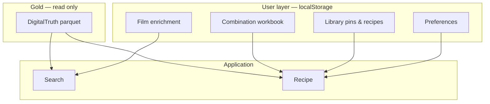

# Phase 5.3+ — Personal knowledge & information architecture

**Status:** Complete (5.3–5.5)

Builds on [PHASE5_2.md](PHASE5_2.md). Goal: separate **data exploration** from **personal workflow**, and add a structured **user knowledge layer** without mutating gold parquet or opening recipe chat.

---

## Locked decisions

| Decision | Choice |
|----------|--------|
| Recipe interaction | **Annotations & corrections** — structured fields + optional one-shot regenerate; **not** a chat thread |
| Information architecture | **Dashboard** = dataset / explore entry; **Library** (`/library`) = saved items & personal knowledge |
| User notes in gold | **Never** — DigitalTruth gold stays read-only; see [DATA_CONTRACT.md](DATA_CONTRACT.md) |
| Film enrichment (e.g. box speed) | **Personal film profile** — subjective, user-labelled, no server validation |
| Storage scope | **C — Both** (see below) |
| LLM settings UI | **Not in scope** |
| ETL from UI | **Not in scope** (CLI/Docker only) |

### Storage scope C — both keys

Two complementary user layers, both client-side only:

| Layer | Key | Scope | Example |
|-------|-----|--------|---------|
| **Film enrichment** | Canonical `film` name | One profile per film stock | Box speed ISO 400, typical EI 320, “meter for shadows” |
| **Combination workbook** | `(film, developer, format, iso, dilution)` | Notes for a specific lookup row | +15% dev time on hot days; optimize for scanning |

**Inheritance at recipe time:**

1. Chart time from gold (always shown, never overwritten)
2. Film enrichment → pre-fill Search (nominal ISO, hints)
3. Combination workbook → overrides for that exact row when present
4. Global + per-film preferences → `extra_context` (existing)

Combination keys are **more specific** than film-level keys. Film enrichment never replaces chart ISO rows — it only informs the user’s workflow and form defaults.

---

## Design principles



1. **Chart time is sacred** — displayed separately from “your working time”.
2. **Subjective data is labelled** — UI copy: “Your notes (not from DigitalTruth)”.
3. **No write-back to ETL** — user layer never updates `data/normalized/`.
4. **Export/import** — library backup format bumps to **v2** with backward-compatible v1 import.

---

## Iteration breakdown

### Phase 5.3 — Information architecture (IA) ✅

**Goal:** Dashboard for data; Library for personal items.

| Task | Deliverable |
|------|-------------|
| New route | `/library` — saved combinations, saved recipes, favorites, recent queries |
| Slim dashboard | Stats, dataset freshness, links to Explorer/catalog only |
| Navigation | Dashboard · Search · Explorer · **Library** · Preferences |
| Move components | `SavedCombinations`, `SavedRecipes`, `FavoritesPanel`, `RecentQueries` → Library page |
| Docs | Update [PORTFOLIO.md](PORTFOLIO.md) demo script |

**Exit criteria:** Dashboard has no saved-item sections; Library is the single place for pins and favorites.

---

### Phase 5.4 — Personal knowledge layer ✅

**Goal:** Structured annotations and film enrichment (storage scope C).

#### 5.4a — Film enrichment

| Field | Type | Notes |
|-------|------|--------|
| `film` | string | Canonical name (autocomplete) |
| `boxSpeedIso` | string | Optional; user’s nominal box speed |
| `typicalEi` | string | Optional; habitual exposure index |
| `notes` | string | Free text |
| `updatedAt` | ISO string | Audit |

- UI: section on **Library** or **Preferences** — “Personal film notes”
- Search: when film selected, pre-fill `isoNominal` from enrichment if set
- Always show badge: **not from chart**

**Storage key:** `film-agent:film-enrichment` → `Record<film, FilmEnrichment>`

#### 5.4b — Combination workbook

| Field | Type | Notes |
|-------|------|--------|
| `film`, `developer`, `format`, `iso`, `dilution` | string | Match gold lookup row |
| `adjustedDevTime` | string | e.g. `13.5` minutes — user working time |
| `adjustmentReason` | string | e.g. hot weather, scanning |
| `outputGoal` | `print` \| `scan` \| `both` | Optional enum |
| `environmentNotes` | string | Temperature, water, etc. |
| `workflowNotes` | string | Free markdown |
| `updatedAt` | ISO string | Audit |

- UI: **Recipe page** sidebar — “My notes” (editable, save)
- Optional: link from Search after confirm; edit from Library combo row
- **Regenerate with notes** — single button merges workbook + prefs into `extra_context` once (not a chat)

**Storage key:** `film-agent:combination-workbook` → map keyed by `film|developer|format|iso|dilution`

#### 5.4c — Recipe display rules

- Always show: **Chart time** (from lookup) vs **Your working time** (if set)
- Disclaimer on adjusted time: user responsibility
- Saved recipe markdown remains a snapshot; workbook is live metadata alongside it

#### 5.4d — Library export v2

Extend `UserLibraryExport`:

```typescript
version: 2;
filmEnrichment: Record<string, FilmEnrichment>;
combinationWorkbook: Record<string, CombinationWorkbookEntry>;
// … existing v1 fields
```

Import: accept v1 and v2; missing new keys default to empty.

**Exit criteria:** User can set box speed per film, annotate a specific combo, see chart vs personal time on Recipe, export/import v2 backup. ✅

---

### Phase 5.6 — Session card (Tier 1 workflow) ✅

**Goal:** Sink-ready checklist without LLM — default path for multi-roll sessions.

| Deliverable | Notes |
|-------------|--------|
| Session card | Chart time, working time, dilution volumes, stop bath, agitation, pre-soak |
| Darkroom prefs | `tankVolumeMl`, `stopBathRecipe`, `presoakDefault` |
| Save session | Pins combo to library; workbook stores per-row overrides |
| `/session` route | Open saved sessions from library |
| Export v3 | Extended preferences in backup |

**Deferred (Tier 2):** Optional LLM “scan brief” — one-shot synthesis when chart notes are silent.

---

| Task | Notes |
|------|--------|
| Developer comparison | `/compare` — same film / format / ISO, side-by-side chart times (gold only) |
| Print / PDF card | Print summary with chart time, your working time, and recipe body |
| PWA offline | Installable app shell; saved/default recipes readable offline |

---

## UX flows (target)

### Search with film enrichment

1. User selects **Ilford HP5 Plus**
2. If film enrichment has `boxSpeedIso: 400` → pre-fill nominal ISO
3. User sets EI (exposed ISO) → lookup uses EI (unchanged)
4. Push/pull hint still applies when nominal ≠ exposed

### Recipe with workbook

1. User confirms lookup → Generate recipe
2. Sidebar shows chart time; user adds adjusted time + “for scanning”
3. Save workbook (localStorage)
4. Optional: **Regenerate with notes** — one LLM call with merged context
5. Save recipe markdown separately (existing flow)

### Library

1. **Combinations** — open in Search (prefill) or edit workbook
2. **Recipes** — open saved markdown
3. **Favorites** — star films/developers
4. **Film notes** — list enrichment entries

---

## Out of scope (unchanged + explicit)

- Recipe chat / multi-turn LLM editing
- Writing user notes into gold parquet or API “official” fields
- Community / shared corrections dataset
- Server-side validation of box speed or adjusted times
- Automatic push/pull time **calculation** from one chart row
- LLM keys in browser UI
- User accounts / cloud sync
- ETL trigger from web UI

---

## Storage keys (after 5.4)

| Key | Content |
|-----|---------|
| `film-agent:saved-combinations` | Pinned lookup combos |
| `film-agent:saved-recipes` | Markdown snapshots |
| `film-agent:default-recipes` | Map by `film\|developer\|format` |
| `film-agent:favorite-films` | Starred + lookup counts |
| `film-agent:favorite-developers` | Starred + lookup counts |
| `film-agent:user-preferences` | Global profile |
| `film-agent:film-preferences` | Per-film recipe context overrides |
| `film-agent:film-enrichment` | **New** — box speed, typical EI, film notes |
| `film-agent:combination-workbook` | **New** — per-row annotations & adjusted time |

---

## Implementation order

1. **5.3** — Library page + nav (no new data models)
2. **5.4a** — Film enrichment storage + UI + Search prefill
3. **5.4b** — Combination workbook + Recipe sidebar
4. **5.4c** — Chart vs your time display + regenerate with notes
5. **5.4d** — Export v2 + tests
6. **5.5** — Optional polish

---

## Testing (when coding)

| Area | Tests |
|------|--------|
| Storage | Export v1→v2 import; workbook key stability |
| Search | Enrichment pre-fills nominal ISO only |
| Recipe | Workbook merge into `extra_context`; chart time unchanged in API payload |
| IA | Router + nav smoke (manual or light e2e) |

No gold parquet mutation tests — user layer only.

---

## Related docs

| Doc | Purpose |
|-----|---------|
| [DATA_CONTRACT.md](DATA_CONTRACT.md) | Gold remains read-only |
| [PHASE5_2.md](PHASE5_2.md) | Prior personal workflow |
| [LEGAL.md](LEGAL.md) | No redistributing user+chart merged DB |
| [ROADMAP.md](ROADMAP.md) | Master plan |

---

## Exit criteria (phase complete)

**Phase 5.3+** is done when:

- Dashboard is data-focused; Library holds all saved personal items
- Film enrichment and combination workbook work under storage scope **C**
- User annotations never touch gold; UI labels subjective data clearly
- Library backup supports **v2** with backward-compatible import
- [CHANGELOG.md](../CHANGELOG.md) updated; `make check` green
