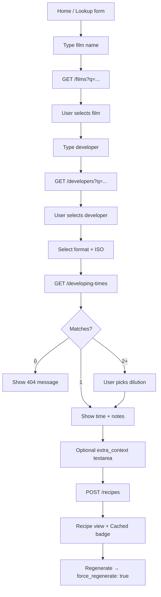

# Phase 5 — Frontend / API Interface Contract

Screen map and iteration plan: **[PHASE5_SCREENS.md](PHASE5_SCREENS.md)** (from [`.interfacerules`](.interfacerules)).

This document locks the **UI ↔ API contract** before building `apps/web/`.  
The backend source of truth for types is `film_agent_api/schemas.py`; OpenAPI is auto-generated by FastAPI.

---

## Principles

1. **UI never scrapes** — read-only queries against gold parquet via API.
2. **Canonical keys** — after fuzzy search, the UI stores and sends `SearchResultItem.name` (normalized lowercase), not display labels.
3. **Lookup before recipe** — always show developing-time results (and resolve dilution) before calling `POST /recipes`.
4. **LLM only on recipe** — search and lookup work without Ollama/OpenAI.
5. **Attribution** — every recipe view shows `source`, `disclaimer`, and optional DigitalTruth link.

---

## API base URL

| Environment | URL |
|-------------|-----|
| Local API | `http://localhost:8000` |
| Vite dev (env) | `VITE_API_URL=http://localhost:8000` |

OpenAPI: `GET /openapi.json` · Swagger UI: `GET /docs`

---

## Endpoints (frozen for Phase 5)

| Method | Path | Purpose | UI usage |
|--------|------|---------|----------|
| `GET` | `/stats` | Dataset counts | Dashboard cards |
| `GET` | `/health` | Liveness | Nav API badge |
| `GET` | `/films?q=&limit=` | Fuzzy film search | Autocomplete |
| `GET` | `/developers?q=&limit=` | Fuzzy developer search | Autocomplete |
| `GET` | `/formats` | Format catalog | Dropdown (filter to scraped formats) |
| `GET` | `/developing-times?film=&developer=&format=&iso=&dilution=` | Exact lookup | Results panel |
| `POST` | `/recipes` | Generate / cache recipe | Recipe page |
| `GET` | `/explorer/schema?layer=` | Column schema per layer | Explorer schema panel |
| `GET` | `/explorer/data?layer=&page=&page_size=&film=&developer=&iso=&source=` | Paginated layer rows | Explorer table + CSV |

### Request / response types

See `film_agent_api/schemas.py`. Summary:

```typescript
// Conceptual — generate TS from openapi.json in Phase 5 setup
interface SearchResultItem {
  name: string;       // send this to lookup/recipe
  value: string | null;
  score: number;
}

interface DevelopingTimeItem {
  film: string;
  developer: string;
  format: string;
  iso: string;
  dilution: string | null;
  dev_time: string;
  temp: string | null;
  notes: string | null;
}

interface RecipeRequest {
  film: string;
  developer: string;
  format: string;     // "35mm" | "120" | "sheet"
  iso: string;
  dilution?: string | null;
  extra_context?: string | null;
  force_regenerate?: boolean;
}

interface RecipeResponse {
  recipe: string;     // markdown/plain text
  cached: boolean;
  cache_key: string;
  source: string;     // "DigitalTruth"
  source_hash: string;
  disclaimer: string;
  prompt_version: string;
  llm_provider: string;
  llm_model: string;
  lookup: RecipeLookupItem;
  extra_context: string | null;
}
```

---

## HTTP error contract

| Status | When | UI behavior |
|--------|------|-------------|
| `404` | No developing time / recipe lookup miss | Inline message: adjust film, developer, ISO, or format |
| `409` | Multiple times, dilution not specified | Show dilution picker from options in message |
| `400` | Invalid input (e.g. `extra_context` too long) | Field validation error |
| `502` | LLM provider failure / timeout | Retry + check Ollama/OpenAI config; raise `OLLAMA_TIMEOUT` for large models |
| `503` | Gold parquet missing | Banner: run `film-agent pipeline --skip-scrape` |

Error body (FastAPI default):

```json
{ "detail": "Human-readable message" }
```

---

## User flow



---

## Screens (MVP)

### 1. Lookup (`/`)

**Form fields**

| Field | Control | API field | Notes |
|-------|---------|-----------|-------|
| Film | Autocomplete | `film` | Debounce 300ms, min 2 chars |
| Developer | Autocomplete | `developer` | Same |
| Format | Select | `format` | Default `120`; options from `/formats` filtered to `35mm`, `120`, `sheet` |
| ISO | Text / select | `iso` | Free text; common values as quick picks (100, 200, 400, 800) |
| Dilution | Select (optional) | `dilution` | Enabled after lookup returns multiple matches |

**Actions**

- **Look up** → `GET /developing-times`
- **Generate recipe** → enabled only after a single match (or dilution chosen)

### 2. Recipe (`/recipe` or inline panel)

**Displays**

- Rendered markdown (`recipe` field)
- Badge: `Cached` when `cached === true`
- Metadata: `source`, `base_time` from `lookup`, `llm_provider` / `llm_model`
- Disclaimer (always visible)
- Link: [DigitalTruth Massive Dev Chart](https://www.digitaltruth.com/devchart.php)

**Actions**

- **Regenerate** → `POST /recipes` with `force_regenerate: true`
- **Print** → print-friendly CSS
- **Copy** → clipboard

---

## UI state model

```typescript
interface LookupFormState {
  filmQuery: string;
  filmSelected: string | null;      // canonical name from search
  developerQuery: string;
  developerSelected: string | null;
  format: string;
  iso: string;
  dilution: string | null;
  extraContext: string;
}

interface LookupResultState {
  matches: DevelopingTimeItem[];
  selectedMatch: DevelopingTimeItem | null;
  error: string | null;
  loading: boolean;
}

interface RecipeState {
  response: RecipeResponse | null;
  loading: boolean;
  error: string | null;
}
```

---

## CORS (required for Vite)

Add to FastAPI before Phase 5 implementation:

```python
# film_agent_api/main.py
from fastapi.middleware.cors import CORSMiddleware

app.add_middleware(
    CORSMiddleware,
    allow_origins=["http://localhost:5173"],  # Vite default
    allow_methods=["GET", "POST"],
    allow_headers=["*"],
)
```

Production: restrict `allow_origins` to deployed web URL.

---

## TypeScript client generation (recommended setup)

```bash
# With API running
curl http://localhost:8000/openapi.json -o openapi.json

# In apps/web/
npx openapi-typescript ../openapi.json -o src/api/schema.d.ts
```

Alternative: hand-written thin client in `apps/web/src/api/client.ts` mirroring the six endpoints.

---

## Out of scope (Phase 5 MVP)

- User accounts / auth
- Pipeline controls from UI (scrape/process stay CLI)
- i18n
- Saving recipes to cloud
- Editing developing times

---

## Phase 5 exit checklist

- [x] CORS enabled for Vite dev server
- [x] `openapi.json` committed + `scripts/export_openapi.py`
- [x] `apps/web/` scaffold with typed `filmApi` client
- [x] Screen map + folder structure ([PHASE5_SCREENS.md](PHASE5_SCREENS.md))
- [x] Tailwind + routing + shared layout
- [x] `GET /stats` for dashboard
- [x] **Iteration 1: Dashboard**
- [x] **Iteration 2: Search + lookup results**
- [x] **Iteration 3: Recipe markdown + Cached badge + Regenerate**
- [x] **Iteration 4: Data Explorer**
- [x] Error states for 404 / 409 / 502 / 503
- [x] `docker compose` runs `api` + `web`

---

## Related files

| File | Role |
|------|------|
| `film_agent_api/schemas.py` | Pydantic models (backend contract) |
| `film_agent_api/main.py` | Route definitions |
| `film_llm/service.py` | Recipe business logic |
| `docs/ROADMAP.md` | Phase 5 goals |
