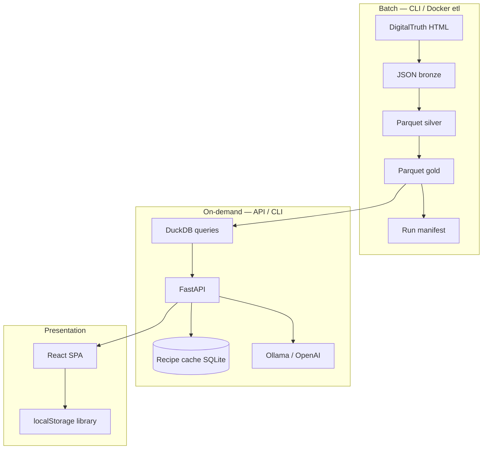

# Portfolio guide

How to present **Film Developer Agent** in interviews, on a CV, or in a README link — focused on data engineering skills, not darkroom product marketing.

---

## Elevator pitch (30 seconds)

> A local-first data pipeline that ingests the DigitalTruth development chart, normalizes it into a gold star schema on Parquet, and exposes it through DuckDB-backed CLI/API queries. An LLM generates step-by-step development recipes anchored to real lookup times — with caching, manifests, and a React UI for personal workflow.

---

## Problem → solution

| Problem | Approach |
|---------|----------|
| Raw HTML tables are not queryable | Bronze JSON → silver typed parquet → gold relational model |
| Film/developer names are messy | Normalization + rapidfuzz search |
| LLMs invent developing times | RAG-style prompt: base time from gold data only; template enforces it |
| Re-scraping invalidates generated content | `source_hash` + SQLite recipe cache invalidation |
| Learning AWS/serverless patterns | Storage abstraction, stateless API, optional Phase 6 Terraform path |

---

## Architecture (talk track)

**Medallion layers:** bronze (immutable scrape), silver (faithful columnar), gold (FKs, long fact table, API-ready).

**Exam tie-ins (AWS SAA / Terraform Associate):**

- Batch ingestion → object storage pattern (local `data/` today, S3 in Phase 6).
- On-demand API vs long-running ETL — Lambda/API Gateway vs Fargate for scrape duration.
- Cache invalidation when upstream dataset version changes — same idea as CloudFront or app-level cache keys.

---

## 5-minute live demo script

1. **Show gold exists** — `ls data/normalized/` or Dashboard stats in the UI.
2. **CLI lookup** — `film-agent times lookup --film "hp5" --developer "rodinal" --format 120 --iso 400`
3. **Fuzzy search** — `film-agent films search "rollei"`
4. **Recipe** — generate in UI or `film-agent recipe ... --output recipe.md`; show `cached: true` on second run.
5. **Library** — saved combinations, recipes, favorites (personal workflow)
6. **Explorer** — open gold layer filtered by film; mention catalog drill-down
7. **Optional DE depth** — open `data/manifests/*.json` or explain pipeline stages in ARCHITECTURE.md

Prep: run pipeline once; have Ollama running or `LLM_PROVIDER=openai` in `.env`.

---

## Skills to highlight on a CV / LinkedIn

| Skill | Evidence in repo |
|-------|------------------|
| ETL / medallion | `digitaltruth_*`, `film_core/pipeline.py`, manifests |
| Parquet / columnar | pyarrow, gzip parquet, DuckDB |
| Data modeling | Gold star schema, FK integrity tests |
| Python packaging | `pyproject.toml`, CLI entry points |
| API design | FastAPI, OpenAPI, error codes 404/409/502/503 |
| LLM integration | Providers, Jinja2 prompts, cache, no hallucinated times |
| Frontend | React, TypeScript, Vite, typed API client |
| DevOps basics | Docker, Compose, GitHub Actions CI |
| Documentation | ARCHITECTURE, ROADMAP, QUICKSTART, LEGAL |

---

## What to say you intentionally did *not* build

Shows scope discipline (good in senior DE interviews):

- No hosted multi-tenant SaaS or user accounts.
- No redistributing DigitalTruth data in the repo.
- No ETL trigger from the public API (CLI/Docker only).
- No Electron — repo + Compose + QUICKSTART instead.
- Phase 6 AWS deploy documented but optional.

---

## Related docs

| Doc | Use when |
|-----|----------|
| [DATA_CONTRACT.md](DATA_CONTRACT.md) | Gold schema & split boundary |
| [ARCHITECTURE.md](ARCHITECTURE.md) | Deep technical Q&A |
| [ROADMAP.md](ROADMAP.md) | Phased delivery story |
| [LEGAL.md](LEGAL.md) | Data ethics / OSS boundaries |
| [QUICKSTART.md](QUICKSTART.md) | Hands-on evaluator setup |
