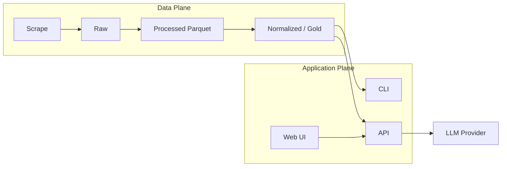
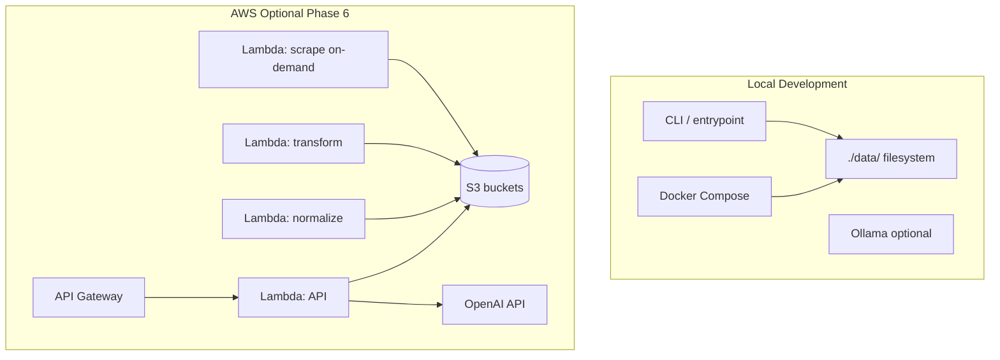
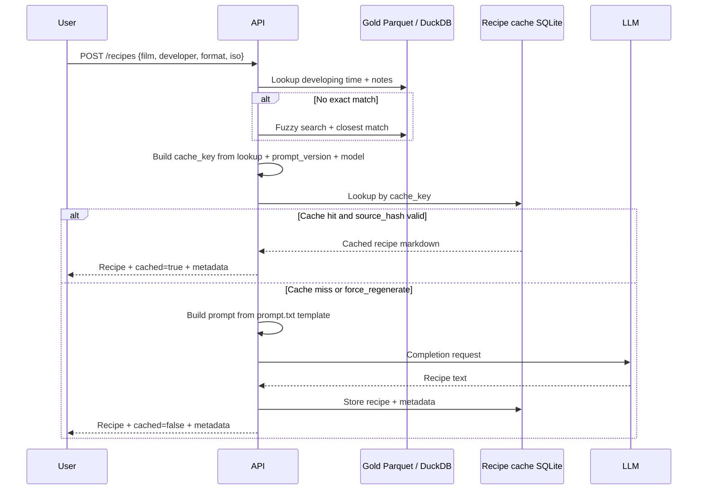

# Film Developer Agent — Product & Engineering Roadmap

This document is the master plan for evolving the project from a local ETL pipeline into a **local-first, serverless-ready** film development assistant with normalized data, a CLI, an API, and a web UI.

---

## Vision

A user picks a **film**, **developer**, **format**, and **ISO**; the system looks up authoritative developing times from DigitalTruth data, then uses an LLM to generate a **step-by-step development recipe** (see `digitaltruth_transformer/prompt.txt`).



---

## Confirmed Decisions (2025-06)

These choices lock the plan. Implementation should follow them unless explicitly revisited.

| Topic | Decision | Implication |
|-------|----------|-------------|
| **Scrape schedule** | Manual or on-demand only | No cron, no EventBridge schedule. User runs `film-agent scrape` or `film-agent pipeline`. API never triggers live scrape. |
| **Recipe language** | English only | `prompt.txt` and all UI copy in English. No i18n until post-MVP. |
| **LLM — local** | Ollama | `LLM_PROVIDER=ollama` (default in dev). Model: `llama3.1:8b` or `mistral`. |
| **LLM — production** | OpenAI API | `LLM_PROVIDER=openai`. GPT-4o-mini for cost, GPT-4o for quality. Keys via `.env` / host secrets. |
| **Web MVP** | React (Vite) | SPA in `apps/web/`. Calls FastAPI. No HTMX path. |
| **AWS / Terraform** | Phase 6, optional | Architecture stays serverless-*ready* (storage abstraction, stateless API). Deploy only if needed. Open-source release does not depend on AWS. |
| **Distribution** | Open source (planned) | Code under OSS license. See [docs/LEGAL.md](LEGAL.md) for data redistribution and DigitalTruth considerations. |

---

| Layer | What exists | Location |
|-------|-------------|----------|
| Scrape | DigitalTruth → raw JSON + metadata | `digitaltruth_scrapper/` |
| Transform | JSON → 4 gzipped Parquet tables | `digitaltruth_transformer/` |
| Orchestration | Sequential pipeline | `entrypoint.py` |
| Container | Docker + Compose | `Dockerfile`, `compose.yml` |
| Docs | Architecture reference | `docs/ARCHITECTURE.md` |

**Important naming clarification:** The current transformer already produces a *normalized star schema*. In the target architecture, we will **rename and split responsibilities** so that:

| Medallion layer | Purpose | Current equivalent |
|-----------------|---------|------------------|
| **Bronze (raw)** | Immutable scrape output | `data/raw/*.json` |
| **Silver (processed)** | Typed, columnar, lightly cleaned | *New explicit stage* → `data/processed/*.parquet.gz` |
| **Gold (normalized)** | API/LLM-ready relational model | *Today mixed into transformer* → `data/normalized/*.parquet.gz` |

Phase 1 stabilizes what you have. Phase 2 introduces the silver/gold split you requested.

---

## Target Architecture

### Design principles

1. **Local-first** — Every stage runs on a laptop via CLI or Docker before any AWS deployment.
2. **Same code, different runtime** — Core logic in importable Python packages; thin wrappers for CLI, Lambda, and API.
3. **Storage abstraction** — Read/write through a `StorageBackend` interface (`LocalFilesystem` now, `S3` later).
4. **Serverless-ready boundaries** — Each pipeline stage is independently invokable, idempotent, and input/output path driven.
5. **Cost-aware** — Scrape is batch/infrequent; API + LLM are on-demand; avoid always-on compute until needed.

### Local vs AWS mapping



| Concern | Local | AWS (optional) |
|---------|-------|-------------------|
| Raw storage | `data/raw/` | `s3://{bucket}/bronze/` |
| Processed parquet | `data/processed/` | `s3://{bucket}/silver/` |
| Normalized parquet | `data/normalized/` | `s3://{bucket}/gold/` |
| Orchestration | `entrypoint.py` / CLI / Compose | Step Functions or manual invoke |
| Scrape job | Docker / CLI | Lambda (15 min limit — may need ECS Fargate if scrape exceeds) |
| Query API | FastAPI + Uvicorn | API Gateway + Lambda (or Lambda Function URL) |
| LLM | Ollama (local) | OpenAI API (prod) |
| Secrets | `.env` (gitignored) | Host env / Docker secrets (no AWS required) |
| IaC | N/A | Terraform optional in Phase 6 |

> **Exam concept (SAA):** This is a classic **batch ingestion → S3 data lake → on-demand compute** pattern. API Gateway + Lambda gives pay-per-request pricing; S3 lifecycle policies can move old parquet to Glacier for cost.

---

## Data Pipeline Stages (Detailed)

### Stage 1 — Scrape (Bronze)

**Status:** Implemented  
**Trigger:** Manual or on-demand only (`film-agent scrape` / `film-agent pipeline`)  
**Input:** DigitalTruth HTML  
**Output:** `data/raw/*.json` + `.meta.json`

**Future hardening (Phase 1):**
- Optional: also write bronze Parquet for columnar raw archive
- Structured logging + run manifest (`run_id`, record counts, failures)
- Data quality checks (min film count, hash drift alerts)

---

### Stage 2 — Process to Parquet (Silver)

**Status:** Partially implemented (today's transformer)  
**Input:** Bronze JSON  
**Output:** `data/processed/*.parquet.gz`

**Responsibility:** Parse, type-cast, dedupe, wide-format fact table — **minimal business rules**. This is the "raw parquet" layer you mentioned: faithful to source, columnar, compressed.

**Outputs (unchanged files):**
- `digitaltruth_films.parquet.gz`
- `digitaltruth_developers.parquet.gz`
- `digitaltruth_formats.parquet.gz`
- `digitaltruth_film_data.parquet.gz` (still wide: 35mm / 120 / sheet columns)

**Refactor:** Rename package mentally from "transformer" to **processor**; keep melt/FK logic out of this stage.

---

### Stage 3 — Normalize (Gold) — NEW

**Status:** Planned  
**Input:** Silver Parquet  
**Output:** `data/normalized/*.parquet.gz`

**Responsibility:** Everything needed for querying and LLM context:

| Table | Key operations |
|-------|----------------|
| `films` | Dimension, slug/id, search-friendly names |
| `developers` | Dimension |
| `formats` | Dimension |
| `developing_times` | Melt wide→long, FK assignment, drop nulls |
| `developing_times_lookup` *(optional view)* | Denormalized flat table for fast API search |

**Additional gold-layer concerns:**
- Surrogate keys stable across runs (hash-based `film_id` vs sequential)
- `search_text` column for fuzzy film/developer matching
- Version stamp / `dataset_version` in parquet metadata
- Validation report JSON alongside outputs

**Package:** `film_normalizer/` (new) or extend transformer with clear sub-stage split.

---

## Application Layer

### Phase 4 — CLI (first consumer)

**Tool:** `typer` or `click` → package `film_agent_cli/`

```bash
# Data pipeline
film-agent scrape
film-agent process
film-agent normalize
film-agent pipeline          # scrape → process → normalize

# Query
film-agent films search "rollei"
film-agent times lookup --film "..." --developer "rodinal" --format 120 --iso 400

# Recipe generation
film-agent recipe \
  --film "Rollei Retro 400S" \
  --developer "Rodinal" \
  --format 120 \
  --iso 400 \
  --dilution "1+50" \
  --output recipe.md

film-agent recipe ... --force   # bypass cache, call LLM
```

**Why CLI first:** Validates data model and LLM prompt without UI complexity. Same service layer powers API later.

---

### Phase 5 — API + LLM Recipe Generation

**Stack:** FastAPI (`film_agent_api/`)

| Endpoint | Method | Purpose |
|----------|--------|---------|
| `/health` | GET | Liveness |
| `/films` | GET | List/search films |
| `/developers` | GET | List/search developers |
| `/formats` | GET | List formats |
| `/developing-times` | GET | Lookup by film + developer + format + iso |
| `/recipes` | POST | Generate or return cached LLM recipe |

**Recipe flow (with cache):**



**Prompt strategy:**
- `prompt.txt` becomes a Jinja2 template with slots: `{film}`, `{developer}`, `{base_time}`, `{temperature}`, `{dilution}`, `{format}`, `{notes}`
- System message: safety, no hallucinated times — base time must come from data
- Include `source: DigitalTruth` and scrape date in response metadata

#### Recipe cache

Reduce LLM calls by storing generated recipes for exact lookup combinations. Separate from the gold catalog (facts) — this is **derived content**.

| Aspect | Decision |
|--------|----------|
| **Storage** | SQLite at `data/cache/recipes.db` (gitignored) |
| **Cache key** | Hash of `film`, `developer`, `format`, `iso`, `dilution`, `temperature`, `base_time`, `prompt_version`, `llm_provider`, `llm_model`, `language` |
| **Invalidation** | New gold `source_hash` after pipeline run; `prompt_version` bump; optional TTL |
| **Bypass** | `force_regenerate: true` on `POST /recipes` or CLI `--force` |
| **AWS later** | Optional S3 prefix or DynamoDB only if multi-instance shared cache needed |

**Schema (SQLite):**

```sql
CREATE TABLE recipe_cache (
    cache_key       TEXT PRIMARY KEY,
    film            TEXT NOT NULL,
    developer       TEXT NOT NULL,
    format          TEXT NOT NULL,
    iso             TEXT NOT NULL,
    dilution        TEXT NOT NULL,
    temperature     TEXT,
    base_time       TEXT NOT NULL,
    recipe_markdown TEXT NOT NULL,
    source_hash     TEXT NOT NULL,
    prompt_version  TEXT NOT NULL,
    llm_provider    TEXT NOT NULL,
    llm_model       TEXT NOT NULL,
    created_at      TEXT NOT NULL,
    last_used_at    TEXT,
    use_count       INTEGER DEFAULT 1
);
```

**Response metadata example:**

```json
{
  "recipe": "...",
  "cached": true,
  "cache_key": "...",
  "source": "DigitalTruth",
  "source_hash": "...",
  "disclaimer": "Verify all times independently."
}
```

**Package:** `film_llm/recipe_cache.py` — shared by API and CLI `film-agent recipe`.

---

### LLM Provider Options

| Option | Best for | Pros | Cons | Cost |
|--------|----------|------|------|------|
| **Ollama (local)** | Local dev, offline | Free, private, fast iteration | Weaker models | $0 |
| **OpenAI API** (GPT-4o-mini / GPT-4o) | Production | Excellent instruction following, simple SDK | External dependency, API key, per-token cost | ~$0.01–0.05/recipe |
| **LiteLLM** (abstraction) | Multi-provider | One interface for Ollama + OpenAI | Extra dependency | Varies |

**Locked in:**
- **Local dev:** Ollama (`llama3.1:8b` or `mistral`) via `LLM_PROVIDER=ollama`
- **Production:** OpenAI (`gpt-4o-mini` default) via `LLM_PROVIDER=openai`
- **Interface:** `LLMProvider` protocol with `generate_recipe(context) -> RecipeResponse`

---

### Phase 6 — Web Interface

**Locked in:** **React + Vite** SPA in `apps/web/` calling the FastAPI backend.

**Core screens:**
1. Search film / developer
2. Developing time lookup results
3. Recipe generator form → rendered markdown recipe
4. (Later) Save/export recipes, print view

---

## Proposed Repository Structure (Target)

```
film-developer-agent/
├── packages/                          # Shared libraries (future)
│   ├── film_scraper/                  # rename from digitaltruth_scrapper
│   ├── film_processor/                # silver layer (from transformer)
│   ├── film_normalizer/               # gold layer (NEW)
│   ├── film_core/                     # models, storage backend, config
│   └── film_llm/                      # prompt templates + LLM providers
│
├── apps/
│   ├── cli/                           # Typer CLI
│   ├── api/                           # FastAPI
│   └── web/                           # Frontend (Phase 6)
│
├── infra/                             # Terraform (Phase 7)
│   ├── modules/
│   │   ├── s3/
│   │   ├── lambda/
│   │   ├── api_gateway/
│   │   └── eventbridge/
│   └── environments/
│       ├── local/                     # LocalStack or minio notes
│       └── dev/
│
├── data/                              # Local only (gitignored outputs)
│   ├── raw/                           # bronze
│   ├── processed/                     # silver
│   ├── normalized/                    # gold
│   ├── cache/                         # recipe cache SQLite (Phase 4)
│   ├── historical/
│   └── manifests/
│
├── docs/
│   ├── ARCHITECTURE.md
│   └── ROADMAP.md                     # this file
│
├── docker-compose.yml                 # full local stack
├── Dockerfile
└── pyproject.toml                     # monorepo / workspace (future)
```

Migration can be **incremental** — no big-bang rewrite. Wrap existing modules first, split later.

---

## Phased Delivery Plan

### Phase 0 — Baseline ✅
- [x] Scrape DigitalTruth
- [x] Process to Parquet
- [x] Architecture docs
- [x] Code quality fixes (headers, rate limits, metadata)

---

### Phase 1 — Stabilize & Package ✅

**Goal:** Reliable local pipeline, clear contracts between stages.

| Task | Deliverable | Status |
|------|-------------|--------|
| Introduce `film_core` with `StorageBackend` | `LocalStorage` reading `DATA_PATH` | Done |
| Add pipeline run manifest | `data/manifests/{run_id}.json` | Done |
| Basic data tests | pytest: row counts, FK integrity, required columns | Done |
| `pyproject.toml` + optional venv docs | Reproducible installs | Done |
| CI skeleton | GitHub Actions: lint + test (no AWS) | Done |

**Exit criteria:** `entrypoint.py` runs end-to-end with tests green.

---

### Phase 2 — Silver / Gold Split ✅

**Goal:** Separate processed parquet from normalized data.

| Task | Deliverable | Status |
|------|-------------|--------|
| Refactor transformer → **processor** (silver only) | Wide fact parquet, no melt | Done |
| Create **normalizer** (gold) | Melt, FKs, lookup view | Done |
| Update `entrypoint.py` | 3-stage pipeline | Done |
| Update `docs/ARCHITECTURE.md` | Medallion diagram | Done |
| Gitignore `data/` outputs; format catalog in `catalogs/` | OSS-ready layout | Done |

**Exit criteria:** `data/processed/` and `data/normalized/` are distinct; API can read from gold only.

---

### Phase 3 — CLI + Query Layer ✅

**Goal:** First user-facing tool (your item #5 — CLI first).

| Task | Deliverable | Status |
|------|-------------|--------|
| `film_agent_cli` with Typer | `film-agent` commands | Done |
| DuckDB in-process queries over gold parquet | `film_core/query/gold_store.py` | Done |
| Fuzzy search (rapidfuzz) | `films search`, `developers search` | Done |
| Lookup command | `times lookup` — developing time + metadata | Done |

**Exit criteria:** Generate a lookup result from CLI without running the scraper.

---

### Phase 4 — API + LLM Recipes ✅

**Goal:** Recipe generation via API (your items #4 and #5), with caching to minimize LLM cost and latency.

| Task | Deliverable | Status |
|------|-------------|--------|
| FastAPI app | `film_agent_api/` — health, search, lookup, recipes | Done |
| Jinja2 prompt template | `film_llm/templates/recipe_prompt.j2` | Done |
| `LLMProvider` with Ollama + OpenAI | Env-driven `LLM_PROVIDER` | Done |
| **Recipe cache (SQLite)** | `data/cache/recipes.db` | Done |
| `RecipeCacheService` | Cache key, `source_hash` invalidation, `force_regenerate` | Done |
| `POST /recipes` | Markdown + `cached` flag + source attribution | Done |
| CLI `film-agent recipe` | Same `RecipeService`; `--force` bypasses cache | Done |
| Safety disclaimer in output | Appended to every recipe | Done |

**Exit criteria:**
- `film-agent recipe --film ...` returns a numbered recipe using real lookup data.
- Second identical request returns `cached: true` with **no LLM call**.
- Re-run pipeline (new `source_hash`) invalidates stale cache entries.

---

### Phase 5 — Web UI (2–3 weeks)

**Goal:** Browser access to lookup + recipe (your item #5 — web).

| Task | Deliverable |
|------|-------------|
| React + Vite frontend | Search + recipe form in `apps/web/` |
| Docker Compose services `api` + `web` | Full local stack |
| Recipe markdown rendering | Print-friendly CSS |
| Cached recipe UX | Show `Cached` badge; **Regenerate** → `force_regenerate` |

**Exit criteria:** User can generate a recipe in the browser against local API; repeat lookup uses cache unless regenerated.

---

### Phase 6 — Serverless AWS (optional, 3–4 weeks)

**Goal:** Deploy to AWS only if needed. Architecture in Phases 1–5 must not require AWS.

**Status:** Deferred — open-source and local/Docker release is the primary target.

| Task | Deliverable |
|------|-------------|
| Terraform: S3 buckets (bronze/silver/gold) | `infra/` modules |
| Lambda layers for pandas/pyarrow | Or container images if package too large |
| API Gateway + Lambda (FastAPI via Mangum) | Hosted API |
| OpenAI via env / Secrets Manager | Same `LLM_PROVIDER=openai` as non-AWS prod |
| LocalStack or MinIO docs | S3-compatible local testing |

**Not planned:** Scheduled scraping (manual/on-demand only).

**Exit criteria:** Same CLI flags work with `STORAGE_BACKEND=s3` on AWS.

**Cost warning:** Lambda + large dependencies (pandas/pyarrow) can be slow/cold-start heavy. Alternatives:
- **ECS Fargate** for scrape/normalize jobs (better for long ETL)
- **Athena** over S3 parquet for ad-hoc queries (pay per scan)
- **DuckDB on Lambda** is possible but memory-limited

---

## Key Technical Decisions

| # | Decision | Choice |
|---|----------|--------|
| 1 | Gold layer ID strategy | Hash-based stable IDs (`sha256(name)[:8]`) for idempotent merges |
| 2 | Query engine local | **DuckDB** — native parquet, SQL, low ops |
| 3 | API framework | **FastAPI** |
| 4 | LLM local | **Ollama** (`llama3.1:8b` or `mistral`) |
| 5 | LLM production | **OpenAI API** (GPT-4o-mini default, GPT-4o optional) |
| 6 | Scrape trigger | **Manual / on-demand only** — no scheduler |
| 7 | Web MVP | **React + Vite** |
| 8 | Monorepo tool | **uv** or **poetry** workspace when splitting packages |
| 9 | AWS | **Optional Phase 6** — not required for OSS release |
| 10 | OSS data policy | Ship code + tiny fixtures; users run scraper themselves ([LEGAL.md](LEGAL.md)) |
| 11 | Recipe cache | **SQLite** at `data/cache/`; invalidate on `source_hash` / `prompt_version` change |

---

## Security & Compliance

| Area | Approach |
|------|----------|
| Scraping | Manual/on-demand only; polite rate limits; respect [robots.txt](https://www.digitaltruth.com/robots.txt); see [LEGAL.md](LEGAL.md) |
| LLM output | Never invent developing times — always anchor to gold data |
| LLM training | Do not use DigitalTruth data to train/fine-tune models (`ai-train=no` in their robots.txt) |
| API keys | `.env` locally; never commit secrets |
| API auth | None for local MVP; API key optional for public deployment |
| PII | None expected — public film data only |
| OSS release | Code + fixtures only; full scraped dataset not redistributed |

---

## Testing Strategy

| Layer | What to test |
|-------|--------------|
| Scraper | HTML fixture tests (no live network in CI) |
| Processor | JSON fixture → expected silver schema |
| Normalizer | Silver fixture → gold FK integrity |
| CLI | Integration tests with sample gold data |
| API | `httpx` TestClient, mocked LLM |
| LLM | Snapshot tests on prompt rendering (not live LLM in CI) |

---

## Success Metrics

| Phase | Metric |
|-------|--------|
| Phase 1 | Pipeline runs in < 30 min locally; 0 FK orphans in gold |
| Phase 3 | CLI lookup < 500ms on gold parquet |
| Phase 4 | Recipe includes all 10 sections; cache hit skips LLM on repeat request |
| Phase 5 | End-to-end browser flow < 10s (excl. LLM) |
| Phase 6 | AWS deploy reproducible via `terraform apply` *(if pursued)* |

---

## What We Are NOT Doing Yet

- Multi-source scrapers (beyond DigitalTruth)
- User accounts (recipe cache is per-instance, not per-user auth)
- Mobile native apps
- Real-time scrape on every API request
- Kubernetes (serverless-first per your direction)

---

## Suggested Immediate Next Session

Start with **Phase 5** (React web UI): search + lookup + recipe form calling the FastAPI backend.

---

## Implementation Tickets (Phase 4) ✅

### Phase 4 — API + LLM Recipes
- [x] FastAPI app with query + recipe endpoints
- [x] Jinja2 prompt template from `prompt.txt` structure
- [x] Ollama + OpenAI `LLMProvider`
- [x] SQLite recipe cache with `source_hash` invalidation
- [x] `film-agent recipe` CLI command

---

## Related Docs

| Document | Purpose |
|----------|---------|
| [ARCHITECTURE.md](ARCHITECTURE.md) | Current pipeline technical reference |
| [LEGAL.md](LEGAL.md) | Open source, DigitalTruth, and data redistribution |
